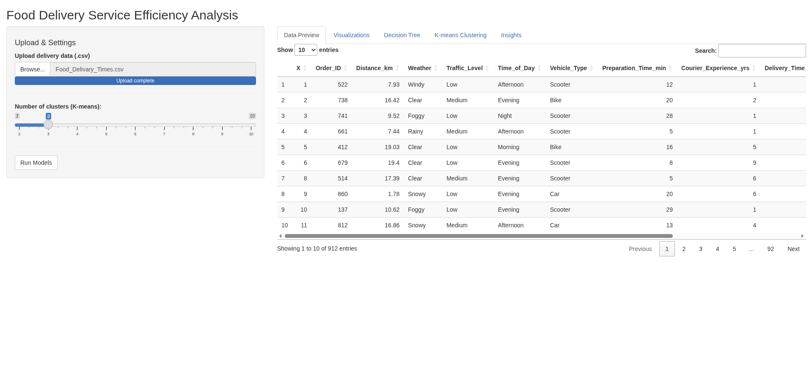
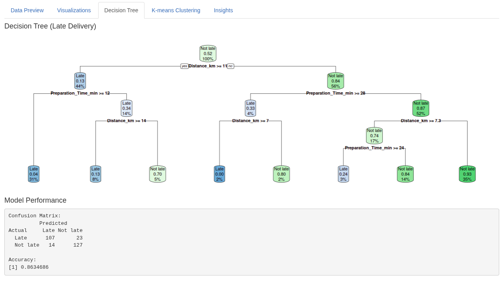
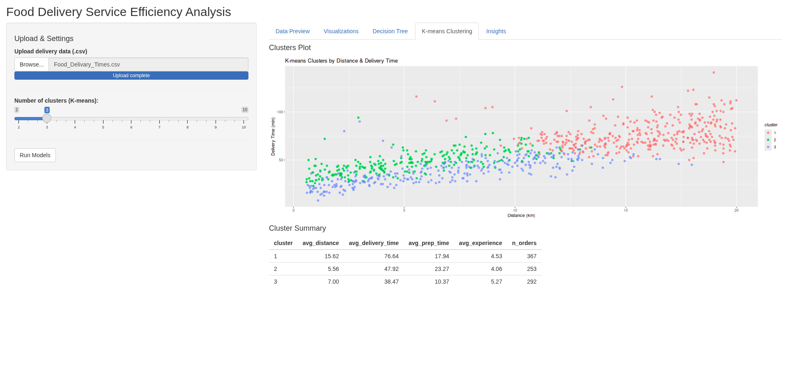

#  Food Delivery Service Efficiency Analysis & Shiny App

###  Project Overview
This project presents a comprehensive analysis of a real-world dataset containing **912 delivery orders**, aimed at identifying the root causes of delivery delays. By leveraging advanced data science techniques, the project provides actionable, data-driven insights to optimize service efficiency, enhance customer satisfaction, and streamline operations.

The study encompasses the entire Data Science lifecycle, culminating in the deployment of an interactive **Shiny Web Application** for real-time decision support.

---

###  The Interactive Dashboard (Shiny App)
We developed a user-friendly GUI to allow stakeholders to upload data, visualize insights, and run models instantly. The dashboard provides a clear preview of the dataset and allows for dynamic interaction.

  

---

###  Project Context & Team
This project was collaboratively developed by my team and me as a capstone university project for the **Data Science** course. Our primary focus was to implement a robust analytical pipeline to solve logistical challenges in the food delivery sector, applying theoretical concepts to a real-world business problem.

---

###  Technical Methodology & Visuals

#### 1. Machine Learning: Decision Tree Model
We developed a classification model to predict the likelihood of late deliveries.
* **Performance:** Achieved an accuracy of **86.35%** on the test set.
* **Key Insight:** The model identified `Distance` and `Restaurant Preparation Time` as the most significant predictors of delay.

  

#### 2. Customer Segmentation (K-Means Clustering)
We segmented orders into **3 distinct clusters** based on delivery characteristics to identify different service patterns.
* **Cluster 1:** Long distance, slow deliveries (High Risk).
* **Cluster 2:** Short distance, average speed.
* **Cluster 3:** Efficient deliveries.

  

---

###  Key Findings & Recommendations
1.  **Primary Bottlenecks:** Analysis confirms that **Kitchen Preparation Time** and **Travel Distance** significantly outweigh environmental factors (traffic/weather) in causing delays.
2.  **Strategic Recommendations:**
    * **Operational:** Optimize kitchen workflows to reduce prep time.
    * **Logistical:** Assign high-speed vehicles (e.g., scooters/motorbikes) specifically to long-distance orders identified by the clustering model.

---

###  Tech Stack
* **Language:** R
* **Framework:** Shiny (Web App)
* **Libraries:** `tidyverse` (Data Manipulation), `ggplot2` (Visualization), `rpart` & `rpart.plot` (Decision Trees), `stats` (Clustering).
